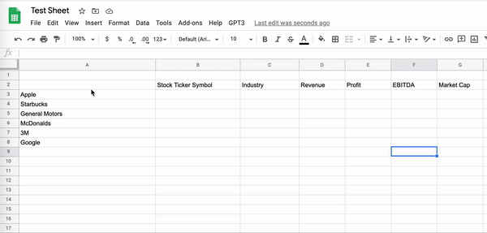

# XofY
A simple integration of GPT3 into google sheets. This script will attempt to fill out a table automatically by inferring the desired entries from the row and column headings.

## Simple Installation

1. Open a google sheet.
2. Click Menu -> Tools -> Script Editor
3. Copy the contents of Code.js into the script editor, and put your OpenAI API key in the relevant location.
4. Click save. You may have to consent to a few authentication dialogs.
5. Refresh your google sheet. You should see a new menu bar item "GPT3".

## Usage

Simply fill out row and column titles for an empty table, highlight the table and headings, and select "GPT3 Fill" from the menu bar. Wait a few moments and you should see entries begin to appear in the table.

The way this script infers what data you want in your table by looking at the row and column headings, so care should be taken in selecting them. We assume that properties are described by column headings and entities are described by row headings. The query that is put to GPT3 is roughly of the form: "What is the [column_heading] of [row_heading]?"
